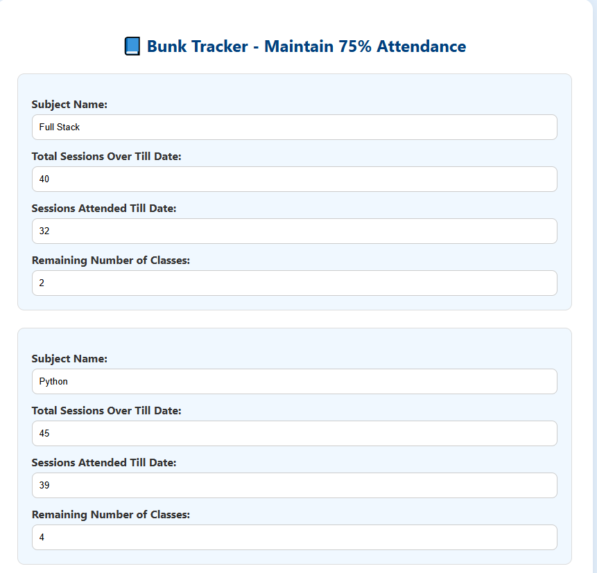

# 🎓 Bunk Tracker - 75% Attendance Rule Calculator

A simple and smart web application to help students calculate how many classes they can afford to bunk — or must attend — to maintain the mandatory 75% attendance rule.

## 📌 Features

- 🔢 Input details for multiple subjects
- 📊 Calculates current attendance %
- 🚫 Tells how many classes you can *bunk* safely
- ✅ Shows how many classes you *must attend* if attendance is below 75%
- ➕ Dynamically add or remove subject entries
- 🧠 Built using HTML, CSS, and JavaScript

## 🚀 Live Demo

👉 [Link to Demo (optional)](https://anishahkandachar2002.github.io/bunktracker/)

## 📷 Screenshot



## 🛠️ Tech Stack

- HTML5
- CSS3
- JavaScript (Vanilla)

## 📥 How to Use

1. **Clone the repository:**
   ```bash
   git clone https://github.com/yourusername/bunk-tracker.git
   cd bunk-tracker
